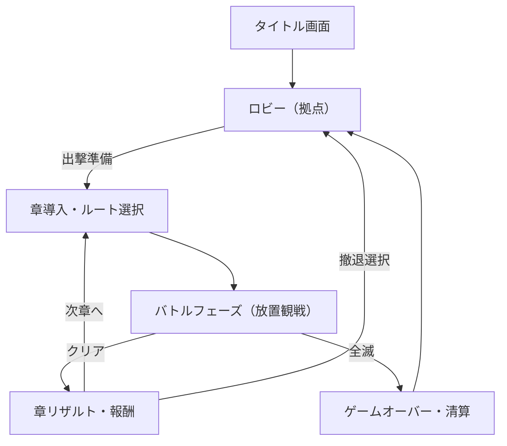

# Gocha Rumble 3D 部内用詳細仕様書

**作成日**: 2026-01-13
**バージョン**: 2.0 (統合詳細版)
**元資料**:
- `docs/仕様/20260113_141959_製品仕様書.md`
- `docs/仕様/20260113_142849_楽しさ要素提案.md`
- `docs/仕様/20260113_174406_編集長レビュー.md`

---

## 1. プロジェクト方針とデザインフィロソフィー

本プロジェクトは**「操作の忙しさ」を排し、「圧倒的な視覚的快感（わちゃわちゃ感）」と「ビルド構築の戦略性」**に特化した放置型3Dオートバトラーである。

### 1.1 コアバリュー（絶対にブレてはいけない軸）
1.  **操作しない贅沢**: プレイヤーの仕事は「準備」と「介入判断」のみ。バトル中は神の視点で「眺める」ことに集中させる。
2.  **1000体の群れ感**: 個々の精密な動きより、集団としての「うねり」「圧力」「崩壊」のカタルシスを優先する。
3.  **見てわかる成長**: 数値だけでなく、見た目の派手さ、エフェクトの密度で「強くなった」ことを実感させる。

### 1.2 編集長レビューからの重要フィードバック反映
*   **技術的挑戦**: Webブラウザで1000体を60fpsで動かすため、LODや物理演算の簡略化（嘘物理）を徹底する。
*   **退屈対策**: 負けパターンや膠着状態のストレスを軽減するため、敗因の可視化とリプレイ性を高める。
*   **UIの引き算**: 画面情報の過多を防ぐため、HUDは極力シンプルにし、ダメージ表示などは間引き処理を行う。

---

## 2. ゲームループ詳細フロー

### 2.1 フェーズ遷移

### 2.2 各フェーズ詳細

#### A. ロビー（拠点）
*   **機能**:
    *   同僚機（捕獲したミニオン）の編成・管理。
    *   図鑑閲覧（敵、シナジー、環境）。
    *   永続強化（アンロック要素の確認）。
*   **UI/演出**: テラリウムの内部。捕獲したミニオンたちが背景でくつろいでいる。

#### B. 出撃準備・章導入
*   **意思決定項目**:
    *   **ルート選択**: 次の「環境条件」（霧、重力、磁気など）を選択。
    *   **初期ビルド**: 持ち込むミニオンの種類と初期装備。
    *   **難易度**: リスクとリターン（捕獲率など）の調整。
*   **敵適応情報の開示**: 「前の章で◯◯が多かったため、敵は△△対策をしてきている」という予兆を表示。

#### C. バトルフェーズ（メイン）
*   **プレイヤー操作**:
    *   **カメラ操作**: 360度回転、ズームイン/アウト（マクロ視点⇄ミクロ視点）。
    *   **介入（限定的）**: 「撤退」指示（任意のタイミングで清算して帰還）。※スキル発動等の直接介入は行わない。
*   **システム挙動**:
    *   敵の波状攻撃（Wave制ではなく連続出現）。
    *   リアルタイムでのユニット進化。
    *   「群れの一斉行動」イベント発生（後述）。

#### D/E. リザルト・清算
*   **クリア時**:
    *   報酬獲得（通貨、アイテム）。
    *   捕獲成功した敵の同僚機化。
    *   「作戦成功」演出（短いカットイン）。
*   **ゲームオーバー時**:
    *   獲得済みリソースの一部持ち帰り（ローグライト的清算）。
    *   **敗因分析**: 「どの敵に」「どのタイミングで」崩されたかを表示。

---

## 3. バトルシステム詳細仕様

### 3.1 ユニットAIと群衆制御（Boids応用）
1000体を描画・制御するため、個別の複雑なパス検索は行わず、**Boids（群群シミュレーション）**を応用した簡易AIを採用する。

*   **分離（Separation）**: 味方同士が重なりすぎないように反発力を働かせる。
*   **整列（Alignment）**: 近くの味方と同じ方向へ進もうとする。
*   **結合（Cohesion）**: 群れの中心へ集まろうとする。
*   **ターゲット追従**: 最寄りの敵（または自機）に向かうベクトルを加算。

**※軽量化の工夫**:
*   衝突判定は「押し出し処理」のみとし、厳密な物理演算（Rigidbody）は使用しない。
*   攻撃判定は距離と角度のみで簡易計算する。

### 3.2 敵の「適応・学習」システム
敵はプレイヤーの戦術を「章単位」で学習し、次章で対策を講じる。

*   **学習トリガー**:
    *   プレイヤー側の「遠距離攻撃比率」が高い → 次章：敵が「反射シェル」や「高速接近」を持つ。
    *   「密集陣形」が多い → 次章：敵が「範囲攻撃」や「自爆」を行う。
*   **実装仕様**:
    *   バトル中に統計データ（被ダメージ要因、プレイヤー位置分布）を収集。
    *   章クリア時に統計を分析し、次章の敵生成テーブルに補正（Buff/Skill追加）を掛ける。
    *   **重要**: 対策は「完全なアンチ」ではなく、「苦戦させる」程度に留める（攻略不可能にしない）。

### 3.3 「群れの一斉行動」イベント（視覚的カタルシス）
特定条件で全ユニットが同期した動きを行い、画面映えを作る。

*   **種類**:
    1.  **シンクロ進化**: 進化ゲージが溜まったユニットが、一定時間内に5体以上いる場合、あえて待機させ、一斉に進化エフェクトを再生する。
    2.  **緊急回避**: ボスの予備動作に合わせて、範囲内の全ユニットが放射状に散開する。
    3.  **包囲殲滅**: ボスHPが残りわずかの際、全ユニットがボスに向かって殺到する（Boidsの結合力をボス座標に極大化）。

---

## 4. ビジュアル・演出仕様

### 4.1 1000体描画のための技術仕様（Three.js）
*   **InstancedMesh**: 必須。全ユニット（味方・敵）は数種類のジオメトリとマテリアルのインスタンスとして描画。
*   **LOD (Level of Detail)**:
    *   **近距離 (〜20m)**: フルモデル、アニメーションあり、エフェクト詳細。
    *   **中距離 (〜100m)**: 簡易モデル、アニメーション間引き。
    *   **遠距離 (100m〜)**: 低ポリゴンモデル、アニメーションなし（移動のみ）、ビルボード化も検討。
*   **エフェクト**: GPUパーティクルを使用し、CPU負荷を低減。

### 4.2 「壊れビルド」の視覚化
シナジーや強化が重なった状態を、数値以外で表現する。

*   **段階的変化**:
    *   **Lv1**: 通常攻撃エフェクト。
    *   **Lv2**: エフェクトサイズ拡大、色変化。
    *   **Lv3 (壊れ)**: 攻撃軌跡が残留する、画面全体がわずかに歪む、SEが重厚になる。
*   **狙い**: 「なんかすごいことになっている」という感覚を直感的に伝える。

### 4.3 ダメージ表示の抑制（UIガイドライン）
1000体が攻撃すると画面が数字で埋め尽くされるため、以下の制御を行う。

*   **間引き表示**:
    *   通常ダメージ：表示しない、または非常に小さく薄く表示（一定数でフェードアウト）。
    *   **クリティカル/特効**: 大きく、派手なフォントで表示。
    *   **合算表示**: 短時間の連続ヒットは1つの数字にまとめてカウントアップ表示する（「100!」→「500!!」→「1500!!!」）。

---

## 5. コンテンツ仕様

### 5.1 同僚機（ミニオン）システム
*   **獲得**: 敵を「捕獲（キャプチャ）」することで入手。
    *   条件：特定アイテム所持、または「状態異常中の敵を倒す」などの特定条件達成時。
*   **個性**:
    *   元敵ユニットの特性を引き継ぐ。
    *   ランダムな「性格」（好戦的、慎重、護衛好き）が付与され、AIの重み付け（Boidsパラメータ）が変化する。

### 5.2 図鑑システム（コレクション）
*   **収録内容**:
    *   **生態記録**: 敵の特徴と、プレイヤーへの「適応パターン」の履歴。
    *   **シナジー**: 発見したパークや装備の組み合わせ。
*   **報酬**: 図鑑を埋めることで、ロビーの装飾アイテムや、初期リソースの微増などのボーナスを得る。

### 5.3 ハイライト機能（MVP後実装予定）
*   バトル中の「ピーク（最大ダメージ瞬間、最大撃破密度）」のタイムスタンプを記録。
*   リザルト画面で、その瞬間をGIFアニメーションや短いリプレイとして再生・保存できる機能。

---

## 6. 技術要件まとめ

### 6.1 クライアント (Frontend)
*   **FW**: React + Vite
*   **3D**: Three.js (@react-three/fiber, @react-three/drei)
*   **State**: Zustand (頻繁な更新に耐えうる軽量なもの)
*   **Perf**:
    *   ターゲット: PCブラウザで60fps維持（ユニット1000体時）。
    *   Canvas: `frameloop="always"` だが、ロビー等は `demand` に切り替える等の制御。

### 6.2 サーバー (Backend)
*   **Infra**: Firebase
*   **Auth**: Google Auth (匿名ログイン対応推奨)
*   **DB (Firestore)**:
    *   ユーザープロファイル（所持同僚機、図鑑、実績）。
    *   ランキングデータ（非同期PvP用）。
    *   「今日のシード値」配信（デイリーランキング用）。

---

## 7. 今後のタスクと優先度

1.  **プロトタイプ改修**: Boidsシミュレーションによる1000体描画負荷テスト（LOD実装含む）。
2.  **コアゲームループ実装**: ロビー⇄バトルの遷移と、データ永続化。
3.  **UI実装**: HUDの間引き処理と、「壊れ演出」のシェーダー作成。
4.  **敵AI実装**: 学習ロジックの設計とデータベース構造の決定。

以上
