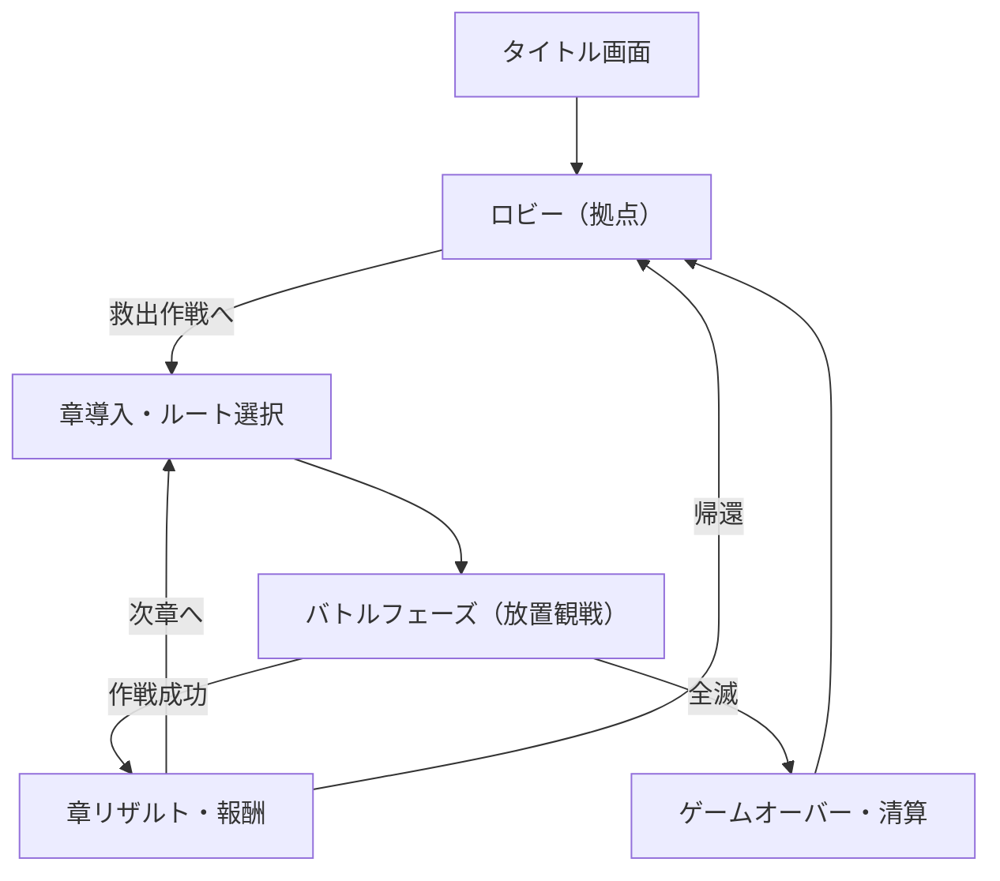

# Gocha Rumble 3D 部内用詳細仕様書 v3.0

**作成日**: 2026-01-13
**バージョン**: 3.0 (経営会議FB反映・開発プロセス改訂版)
**承認状況**: 条件付き承認（フェーズ1着手可）

---

## 1. プロジェクト方針とデザインフィロソフィー

### 1.1 コアバリュー（絶対にブレてはいけない軸）
1.  **操作しない贅沢**: プレイヤーの仕事は「準備」と「介入判断」のみ。
2.  **スマホでも1000体の群れ感**: PC/スマホを問わず、圧倒的な「わちゃわちゃ感」を保証する。
3.  **見てわかる成長**: 数値だけでなく、見た目の派手さで成長を実感させる。
4.  **救済と共闘**: 敵を「捕獲・洗脳」するのではなく、暴走する機械を「救出・同僚化」する世界観。

### 1.2 経営会議フィードバックへの対応（必須要件）
*   **スマホ品質担保**: 縦画面UIを標準とし、モバイルでのLOD/メモリ管理を最優先する。
*   **リスク管理（キルスイッチ）**: Firebase予算超過時に機能を自動停止する仕組みを実装する。
*   **コンプライアンス**: 「捕獲」→「救出」へ用語変更。ガチャ確率表記の実装。
*   **運用省力化**: 敵AIの学習・コンテンツ生成の自動化を強化し、運用コストを下げる。

---

## 2. 開発プロセスの方針：TDD & スモールステップ

本プロジェクトは不確定要素（1000体描画、AI学習）が多いため、以下のプロセスを厳守する。

### 2.1 TDD（テスト駆動開発）の導入
*   **ロジック**: ダメージ計算、AI挙動、データ保存などのコアロジックは必ず単体テスト（Vitest）を先に書く。
*   **意図**: 「敵の学習ロジック」などの複雑な仕様が、後の変更で壊れないことを保証するため。
*   **ルール**: `npm run test` が通らないコードはマージしない。

### 2.2 スモールステップ開発と部内評価
いきなり完成品を作らず、以下のマイルストーンごとに部内レビュー会を実施し、手触りを確認する。

| ステップ | 目標 | 検証項目 |
| :--- | :--- | :--- |
| **Step 1** | **「1000体動かす」** | スマホ実機で60fps出るか？ メモリ落ちしないか？ |
| **Step 2** | **「眺めて楽しい」** | Boids挙動の調整。わちゃわちゃ感が気持ちいいか？ |
| **Step 3** | **「成長の実感」** | ビルド変更で見た目が変わるか？ 救出（仲間化）の演出。 |
| **Step 4** | **「ゲームループ」** | ロビー⇄バトルの遷移。広告表示の実装テスト。 |

---

## 3. ゲームループ詳細フロー（改訂版）

### 3.1 フェーズ遷移

### 3.2 重要な変更点
*   **世界観（コンプラ対応）**:
    *   **敵**: 暴走したナノマシン集合体「侵食体」。
    *   **仲間化**: 侵食を取り除き、正常なAIに戻す＝「救出（Rescue）」。ロビーでは「同僚」として共に過ごす。
*   **UI（スマホファースト）**:
    *   PC版もサイドバー広告を考慮し、中央のゲーム画面は縦長（スマホ比率）または正方形をベースに設計しても良い（レスポンシブ対応）。

---

## 4. バトルシステム詳細仕様

### 4.1 ユニットAIと群衆制御（Boids応用）
*   **軽量化**: モバイル端末での動作を保証するため、物理演算（Cannon.js等）は使わず、自作の軽量衝突判定のみで行う。
*   **メモリリーク対策**:
    *   オブジェクトプール（Object Pooling）を徹底する。`new THREE.Mesh` や `new Vector3` を毎フレーム行わない。
    *   シーン遷移時に `dispose()` を確実に呼ぶ仕組みを共通化する。

### 4.2 敵の「適応・学習」システム
*   **目的**: 運用コスト削減（手動バランス調整を減らす）と、ゲームの深み出し。
*   **仕様**: 章クリア時に「プレイヤーの勝利パターン」を分析し、次章の敵パラメータを自動生成する。
    *   例：遠距離攻撃で圧勝 → 次章の敵に「射撃耐性」「高速ダッシュ」タグが付与される。

---

## 5. ビジュアル・演出仕様

### 5.1 モバイル最適化（必須）
*   **LOD (Level of Detail)**:
    *   カメラ距離だけでなく、**「端末のFPS」を監視し、負荷が高い場合は自動で低画質モード（モデル簡略化、エフェクト削減）に切り替える機能**を実装する。
*   **テクスチャ**: 容量削減のため、テクスチャは極力使わず、Vertex Color（頂点カラー）とシェーダーのみで表現する「ローポリ・フラットデザイン」を採用。海外展開もしやすい。

### 5.2 「救出」演出
*   敵を倒した際、爆発四散するのではなく、敵機についた「汚れ（侵食）」が浄化され、味方カラーに変わるエフェクトを入れる。
*   これにより「破壊」ではなく「救済」というポジティブなカタルシスを与える。

---

## 6. マネタイズとサーバー設計（リスク管理）

### 6.1 広告実装
*   **スマホ**: 画面下部に固定バナー（アンカー）。UIはそれと被らない位置（bottom: 60px〜）に配置。
*   **PC**: 画面左右の余白にスカイスクレイパー広告。
*   **動画リワード**: 「救出率アップ」「全滅時のアイテム保護」など、プレイヤー有利なオプションとして実装。

### 6.2 サーバー防衛（キルスイッチ）
*   **予算管理**: Google Cloudの予算アラートと連携し、想定コスト（例: 月1万円）を超えそうになった場合、Firestoreへの書き込みをクライアント側で停止し、ローカル保存モードに強制移行する機能を実装する。
*   **チート対策**: ランキング登録時のみCloud Functionsを通し、あり得ないスコア（1秒でクリア等）をサーバー側で弾く。

---

## 7. 技術スタック（確定）

*   **Frontend**: React + Vite + TypeScript
*   **3D Engine**: Three.js (@react-three/fiber)
*   **State**: Zustand
*   **Test**: **Vitest** (Unit Test), **Playwright** (E2E Test / AdCheck)
*   **Backend**: Firebase (Auth, Firestore, Hosting, Functions)
*   **CI/CD**: GitHub Actions (テスト自動実行)

---

## 8. 次のアクション（Step 1）

まずは **「スマホ実機で1000体が60fpsで動き、メモリリークしないプロトタイプ」** を作成し、部内レビューを行う。
これがクリアできなければ、企画自体を見直す（描画数削減など）覚悟で挑むこと。

以上
